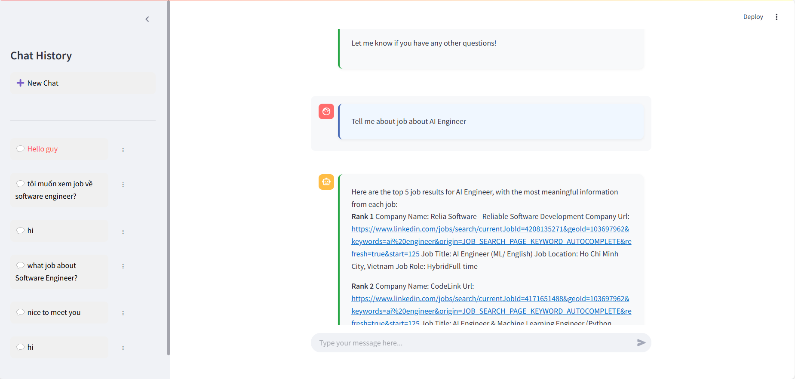
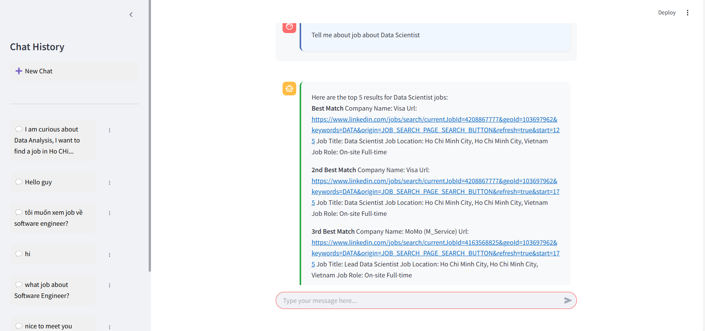

#  Project Title: Linkedin Chatbot Job

<p align="center">
  <a href="README.md">English</a> |
  <a href="README.vi.md">Tiếng Việt</a>
</p>

<a id="english"></a>
# 📌 Overview [English]:
This project was developed by the MNT team (Math and Technology), a young group passionate about technology and mathematics from the University of Science, Vietnam National University Ho Chi Minh City. We aim to explore and apply AI tools in practical contexts. Although small in scale, this project has a clear objective: to research and implement an AI system using LinkedIn data to help users search for job details and get AI assistance with requirements, soft skills, or simply compare different job opportunities. We strive to create a highly practical platform while learning and sharing knowledge with everyone.

**Note 1: As this is a non-profit project, we use free-plan tools focused on the techniques researched and used in the architecture. This may result in some response quality issues compared to paid models. We appreciate your understanding.**

**Note 2: Due to our limited experience with user account management and to avoid token loss or memory overflow, we will temporarily close the service and only showcase code and demos. In the future, we plan to develop the application on Kubernetes to create a web/app for everyone to use.**

**Note 3: Knowledge that we used in here [document](/document/)**

# 📁 Project Structure
```linkedin-chatbot-job-MNT-team/
├── .devcontainer/             # Development container configuration
├── .streamlit/                # Streamlit configuration with secrets.toml
├── document/                  # Project documentation
├── images/                    # Images for README and documentation
├── streamlit_app/             # Main application code
│   ├── app/                   # Streamlit application core
│   ├── db/                    # Database handlers
│   │   └── vector_db/         # Vector database files
│   ├── handlers/              # Request handlers
│   │   └── chat_modules/      # Chat functionality modules
│   ├── helpers/               # Helper functions
│   ├── static/                # Static assets
│   └── utils/                 # Utility functions
│       └── logs/              # Application logs
├── vector_database/           # RAG pipeline implementation
└── web_scrapping/             # LinkedIn data scraping module
    ├── chromedriver-win64/    # Chrome webdriver
    ├── commands/              # Command pattern implementations
    ├── db/                    # Database interactions
    ├── downloaded_files/      # Downloaded job data
    ├── driver/                # Selenium driver wrappers
    ├── factories/             # Factory pattern implementations
    ├── helpers/               # Helper utilities 
    ├── repository/            # Data access layer
    ├── strategies/            # Strategy pattern implementations
    └── utils/                 # Utility functions
        └── logs/              # Scraping logs
```

# 🌟 Features: 
## 1. Web Scraping:
Collects all information from jobs related to keywords in Computer Science and Technology.
- Automated ETL with Selenium to extract comprehensive job information
- Uses Airflow to automate this process

## 2. RAG Pipeline Construction:
Before packaging all vector databases into PKL files, we process the following steps:
- Document creation
- Document splitting for easier processing
- Retriever initialization and fitting to Documents
- Saving to PKL files and uploading to S3 for storage
- When the Chatbot initializes the retriever, it downloads and uses these files

## 3. AI Chatbot:
The project offers basic functions such as:
- Creating new chats
- Deleting chats
- Chatting about the latest LinkedIn jobs, searching by keyword, comparing benefits, career roadmaps for different industries, and preparation techniques
- Viewing chat history 

# 🎥 Demo Website:
Image Demo:

Interface


When everything load successfully


Chat interface


Prompt Sample 1: English


Prompt Sample 2: English


Prompt Sample 3: VIetnamese


Experience link: https://linkedin-chatbot-job-mnt-team.streamlit.app/ (As Streamlit closes resource-intensive applications, we will eventually close this service)

# 🛠️ Installation:
## Clone project
```bash
git clone <link to github project>
```

## Installation necessary packages
```python
pip install -r requirements.txt
```

# Set up environment
## Create a folder .streamlit (recommended)
Create a secrets.toml file with the following API keys:

### WebScrapping: LinkedIn
EMAIL="your_username"
PASSWORD="your_password"

### APP: GROQ API: LLM MODEL
GROQ_API_KEY="your_api"

### APP: MONGO_URI: Memory chat
MONGO_URI="your_api"

### APP: AIVEN: Database (see instructions for creation and quick connect in the database section below)
HOST_AIVEN="your_api" \
USER_AIVEN="your_api" \
PASSWORD_AIVEN="your_api" \
DB_AIVEN="your_api"\
PORT_AIVEN="your_api"\
TABLE_AIVEN="your_api"

### APP: AWS S3: Saving object data (see instructions below in the database section)
S3_BUCKET_JOB="your_api"\
S3_BUCKET_LOG="your_api"\
S3_BUCKET_VECTORDB="your_api"\
PREFIX_VECTORDB="your_api"\
AWS_ACCESS_KEY_ID="your_api"\
AWS_SECRET_ACCESS_KEY="your_api"

### APP: COHERE: ranking function
COHERE_API_KEY="your_api"\

## Create a file .env (not recommended)
You can create a file with the same information as above, but it requires more adjustments. Since we built on Streamlit, we use .streamlit secrets instead of environment variables as in typical projects.

# ⚙️ Usage:


## Run command to set up project
```bash
pip install -e .
```

## Web Scraping: 
because LinkedIn applied Capcha protection, it has many challenge for my scrapping system, so we have to stop developing it.
```bash
cd "<current_path>/linkedin-chatbot-job-MNT-team/web_scrapping"
python main.py
```
or
```bash
python "<current_path>/linkedin-chatbot-job-MNT-team/web_scrapping/main.py"
```

## Without Web Scraping: because we have scrapped, you can use it 
- You can find it into folder: /web_scrapping/processed_data.csv, it contains ~ 300 data sample job, it is scraped from Linkedin (last scraped: 23/4/2025)
- You need push into S3, We have load_data.py, this file is to load data S3, if you need to push it into S3

## AI chatbot:
**Run Vectordatabase**
Run and create retriever
```bash
cd "<current_path>/linkedin-chatbot-job-MNT-team/vector_database"
python rag.py
```
or
```bash
python "<current_path>/linkedin-chatbot-job-MNT-team/vector_database/rag.py"
```

**Run app**
```bash
streamlit run streamlit_app/app/main.py
```

# 🏗️ Architecture for this project:
## Web Scraping


## Vector Database


## App


## Flow AI


# 📊 Database Core:
## Database Schema:


## Connect to Aiven:
We use the Aiven platform with MySQL as our DBMS, configured with:
- 1 CPU
- 1 GB RAM (processing)
- 5 GB Storage

This is a free-plan supporting non-profit projects. Visit: https://console.aiven.io/
- If you create your own database, access your service, click on quick connect, and select Python.
- If you're not the owner, Aiven allows user addition.
- Aiven currently doesn't feature table viewing on their platform, so you can only check using code commands.

## Database for Memory Chat:
We use MongoDB Atlas, a cloud version of MongoDB with extensive developer support.
Note when using MongoDB Atlas:
- To connect, you need a URI. MongoDB Atlas has strong security, so you can only use connections that allow all IP addresses (0.0.0.0). Typically, all IPs are blocked except your local IP.
- Carefully check MongoDB Atlas storage limits. The free plan has many restrictions, and you can't use VPC or advanced connection methods other than 0.0.0.0.

## AWS S3
To connect to S3:
- Go to IAM
- Create access keys
- Copy both: AWS Access Key ID and AWS Secret Access Key
- Create buckets in S3. If you need folders like FAISS, create separate folders for different purposes (e.g., vector_database/faiss)

# 🔧 Technologies Used:
- **Selenium**: Web automation for data extraction
- **Apache Airflow**: ETL workflow orchestration
- **LangChain**: Framework for building RAG pipelines
- **FAISS/BM25/Cohere**: Vector databases for similarity search
- **AWS S3**: Storage for data and models
- **MongoDB Atlas**: Chat history storage
- **MySQL (Aiven)**: Relational database
- **Streamlit**: Web application framework
- **GROQ**: LLM provider
- **Python/JavaScript/CSS/SQL**: Core programming language

# 🤝 Contributing:
Leader: Hang Tan Tai (US)

Member: Nguyen Hoang Nam (US)

Member: Ho Quoc Tuan (US)

# 📝 License:
  
This project is licensed under the MIT License - see the [LICENSE](LICENSE) file for details

# 🙏 Thank you! Donate for my team!!